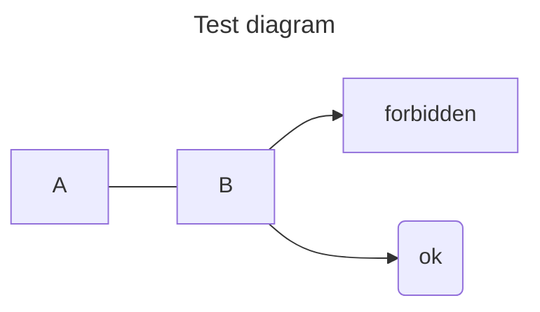

```js webonly
import Chart from 'svelte-frappe-charts';
import { Mbps } from '$lib/format.js';
```

# Sample

```js
let a = 1:3:5;
```

drawio:pg1

This is a: {a}

Another paragraph. {Mbps(1234)}

png:Simple_light_bulb_graphic

```js
$: b = a + 1;
$: c = a < 2;
```

{ b } { c }

```
Code with <html>
```

    Indented code with <html>

## Chart

```js
$: data = {
	labels: ['Sun', 'Mon', 'Tues', 'Wed', 'Thurs', 'Fri', 'Sat'],
	datasets: [
		{
			values: [a, 12, 3, 9, 8, 15, 9]
		}
	]
};
```

<Chart data={data} type="line" />

---

- List **item** 1
  Wrapped
- List ~~item~~ 2
  - List item 2a
    _Wrapped_

## Mermaid


